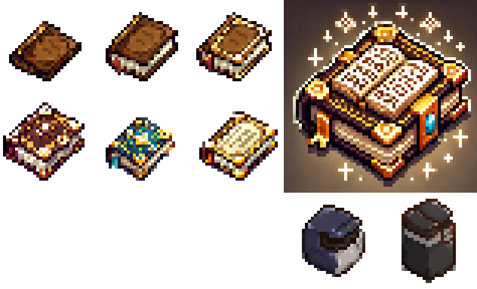

<p style="text-align: center;font-weight: bold;color: lightskyblue;"> TIMAVICIIX's Easy Book Management </p>

### Hi! I'm Robo.Timaviciix📺.
#### &emsp;This document captures some of my thoughts on the development process and my vision for the future of development📜. Of course, you can read it as a diary📝.<br>&emsp;It's very dramatic that I was introduced to module development for _Minecraft_🎮 during the most important days of my software development career, and this is the first time I've developed a module for the game, so I hope you enjoy it.

<p style="text-align: end"> 2025.01.05 <br> Robo.TIMAVICIIX </p>

### 嗨! 我是 Robo.Timaviciix📺.
#### &emsp;这篇文档记录了我在开发过程中的一些思路以及对开发前景的设想📜。当然你可以把它当作日记去看📝。<br>&emsp;很戏剧的是，我在软件开发生涯最重要的日子里中接触到了《我的世界》🎮这款游戏的模组开发，这是我第一次开发该游戏的模组，希望大家喜欢。

<p style="text-align: end"> 2025.01.05 <br> Robo.TIMAVICIIX </p>

TIPS:
```html
❗❗❗
以下的日志就只写中文咯！看不懂请用翻译软件〒▽〒
The following log is only written in Chinese! If you don't understand, please use translation software
❗❗❗
```
---
## <br>2025.01.05
##### &emsp;哈哈，mod教程还没看完呢，先梳理一下mod的制作初衷和需要实现的item,block和功能吧！
##### &emsp;原因是我最近在Minecraft中的一个服务器游玩时，看到了有玩家在服务器中写小说，他们依靠Minecraft中的原生item"书与笔“来写小说；写完之后，玩家们将其放在固定场景的战利品箱子中供大家阅读，就像galgame一样。我在享受阅读的同时也在考虑一些问题。<br>&emsp;这些存放小说书本的箱子上面写着 "看完请放回原位" 。意味着这本小说是被作者签名的成书，但是，这本书被作者编写出来后，需要耗费另外一份"书与笔"；虽然书本能偶复印，但是其他玩家也能够复印这本书，并且能够被随意复印；书本放在宝箱中，如果没有提示，可能还不能被其他玩家发现。我认为这就是我开发这款Mod的初衷。也就是让玩家编写的书本能够有版权意识选择的被复印，出版；此外，这些书本能够通过一些方式展示出来，比如被真正的放到书架上，甚至能够自定义书本封面。 <br>&emsp;
##### "我话讲完，谁赞成？谁反对？" \(\) 下面就草拟出一些我认为该Mod需要的Item之类的吧。

### Item
* #### 复印机【Block】【可放置】\[copier\]：能够接收Minecraft原生书籍，包括"书与笔","成书"等书籍。能够耗费少量的书本与墨囊就复印出大量的书籍。能够进行作者对书本的版权复印设置，并隔离掉原生复印机制（如果你想要复印附魔书，可以通过命令开启权限）
* #### 硒鼓\[toner_cartridge\]：复印机的合成材料，对复印机的合成设置合成门槛，当然，不会很高
* #### 复印机体\[copier_body\]：同上，复印机合成材料
* #### XXX-原稿【Block】【可放置】\[xxx_originals\]：就是签章器生成的原稿咯，无论是附魔书，成书还是书与笔，都能进行签章，签章者既是这本书的作者，只有通过签章这本书才能被复印（当然不会这么死板）
* #### XXX-翻印版【Block】【可放置】\[xxx_reproduced\]：复印机通过原稿复印出的产物，也可以叫复印版

#### 先写到这儿，得睡觉了

---

## <br>2025.01.06
#### &emsp;昨天的item还没写完呢，今天继续吧。
### Item
* #### 墨盒\[ink_box\]：嘿！墨盒和硒鼓不是同一个东西吗！不是的，硒鼓包括了打印机构和墨盒，但是墨盒里面的墨是需要添加的哦！通过墨囊或者煤炭木炭制作墨盒，将墨盒嵌入打印机就行咯？嘶~，这些东西能不能直接放进去啊
* #### 书壳\[book_case\]：什么玩意儿这是？书不是有书壳吗？哦哦，这是用来自定义书本封面的（大悟）
* #### 装订机\[binding_machine\]：书本通过装订机并添加书壳来自定义封面，当封面自定义完成后，复印版也会继承该封面哦

### Block
* #### 签章台【Block】【可放置】\[signature_table\]：能够接收一本书，或者书与笔，并用另一本书进行签章，并合成原稿，该类书本才能够被复印机复印
* #### 便携复印机【Block】【可放置】\[copier\]：能够接收Minecraft原生书籍，包括"书与笔","成书"等书籍。能够耗费少量的书本与墨囊就复印出大量的书籍。能够进行作者对书本的版权复印设置，并隔离掉原生复印机制（如果你想要复印附魔书，可以通过命令开启权限）
* #### 各种木制书架【Block】【可放置】\[t_bookshelf\]：装订封面就是要给人看啊，通过放置书本来展示你的封面吧，书脊会显示你的书名哦
* #### XXX-原稿【Block】【可放置】\[xxx_originals\]：通过放置在书架上,也可以单独堆叠，实际上应该叫书本存储堆
* #### XXX-翻印版【Block】【可放置】\[xxx_reproduced\]：同上


> 我在考虑要不要加入一个新的工作台，这样可以提高配方兼容性

#### 好吧让我们继续，看来我们需要一个独立工作台
* #### 图书管理员的书桌【Block】【可放置】 \[librarian's_desk\]：ChatGPT给它取的名字，还不错哈

#### <br>差不多就是这些吧，开发教程大致看完了，用Kotlin写，效率高一点，画一下材质然后休息啦

---

## <br>2025.01.07
#### &emsp;今天在绘画item图标时又想到了一些Block和item制作流程

### Item
* #### 各类纹理书壳\[bookcase\]：在装订器为你的爱书套上纹理书壳！
* #### 鸡毛掸子\[feather_duster\]：有灰（

### Block
* #### 立式复印机\[duplicator\]：效率是便携复印机的一坤倍
* #### 图书馆大门\[library_gate\]：3x2的大门，辉煌时刻从装修大门开始

#### 今天的item绘画进行顺利，建模教程也看完了，明天继续！



---

## <br>2025.01.08
#### &emsp;又想到了一些item和block

### Block
* #### 独立书本展示台\[book_display\]：单独放一本书进去，还能把书页打开
* #### 玻璃独立书本展示台\[glass_book_display\]：奇异博士都偷不了
* #### 欧式陶瓷茶具套装\[ceramic_tea_set\]：倚着柱子午睡的少女
* #### 小圆桌\[round_table\]：看书必备
* #### 读书椅\[reading_chair\]：没有颈椎负担!

### Item
* #### 蓝色猫猫吊坠\[blue_cat_pendant\]：【增加夜视能力，攻击对手有几率使其迷惑】你在哪儿得到的，别摔坏了！快还回去\(

#### 今天就差不多了吧！又画了一天的图标,建个模睡觉


---

## <br> 2025.01.09
#### &emsp;明明是9号的日志，硬是过了凌晨12点才写
#### &emsp;今天继续新增了一些书的样式，明天再加一个样式就不画了，先把其他方块的图标画出来，建筑方块就不画了，看模型截图要更清晰一点\(不是为了偷懒！\)<br>&emsp;另外便携打印机的建模也出来了，好了睡觉


## <br> 2025.01.10
#### &emsp;距离11号还差 1 h 20 min，今天给立式打印机上色了，又画了几个item，原谅我用ai生成了几个item图标，拿过来改了一下


#### 各类纹理书壳不想画图标了，好累ε(┬┬﹏┬┬)3，先把书本的白模做了，做完碎觉

## <br> 2025.01.11
#### &emsp;哇！书本建模真的好累，我补药画材质啦(T_T)<br>&emsp;等等，给夜之饕宴添加一个书本回收功能，让它放置后能够指定图书管理区域，当书本超过该区域或玩家携带其超过后，书本被收回并归放原位。

### Block
* #### 书梯\[book_stair\]：可以安装在书梯轨道上，能够叠加放置，方便拿取书籍
* #### 书梯轨道\[book_stair_orbit\]：没有这个东西你可能把书梯骑着跑了

#### 好了就这俩了，不画图标了。明天见

## <br> 2025.01.12
#### &emsp;书本白膜还差小型书籍，但是今天又想加入一个书本类型

### Block
* #### 期刊本\[periodical\]：制作简单，印刷方便，适合刊登周期更新的文章

#### 好了好了，今天就先到这儿，明天把小型书籍模型建好，就可以先进行Item开发测试了